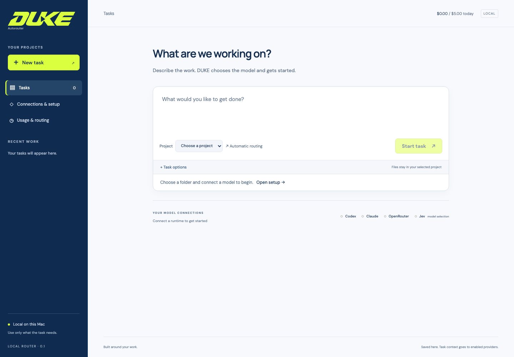

# DUKE Autorouter


**Give it the task. It chooses the model.**

DUKE Autorouter is a Mac app that chooses a model for each task from a roster you
select. Use it for coding, research, writing, and documents across your Codex and
Claude subscriptions and optional OpenRouter models. Jev assesses the task,
chooses an eligible model and supported reasoning effort, and reviews the result.

DUKE aims to use only the model capability and reasoning effort a task needs.
That applies to subscription capacity as well as API spending. A small development comparison found substantially lower model-priced cost with
automatic routing, alongside quality failures. Follow-up checks separate tool
evidence problems from model effort and retain the cost of failed attempts. See
[current development status](docs/CURRENT_STATUS.md) for the results, limitations,
and work not yet included in the downloadable release.

## Version 0.1

The current prerelease is **0.1.6 for Apple Silicon Macs running
macOS 14 or newer**. [Download the signed, notarized Mac app](https://github.com/duke-autorouter/duke-autorouter/releases/download/v0.1.6/DUKE-Autorouter-0.1.6-mac-arm64.dmg).
This repository contains the source, tests, design decisions, and verification
records.

Version 0.1.6 checks specific claims and ownership relationships against source
evidence. An uncertain passage can receive one focused follow-up review before
DUKE decides whether a worker repair is justified. The [development checks](docs/FOCUSED_REVIEW_VALIDATION_20260921.md)
include the original missed PDF error, correct examples and false alarms found
during development. Some correct work still has incomplete checks.

Version 0.1.5 adds bounded same-model effort recovery. Jev can diagnose a failed
check and retry at the next supported effort within your limits. A controlled
live probe repaired a failing implementation. A fresh four-task comparison found
lower model-priced cost with three accepted automatic outputs versus four for
Astra Medium. See the [recovery report](docs/AUTOMATIC_RECOVERY_VALIDATION_20260921.md).

Version 0.1.4 preserves source revision cues and Word table structure in tool
evidence. Explicit model choices now retain Jev content review. The repository
also includes the cost-comparison harness and bounded development checks. See the
[evidence audit](docs/SOURCE_FIDELITY_AUDIT.md).

Version 0.1.3 adds worker inactivity protection and clearer recovery when reviewed
files are missing. See the [reliability follow-up](docs/RELIABILITY_FOLLOWUP.md).

Version 0.1.2 updates follow-up requirements, bounds stalled preparation, and adds
**Retry checks** for saved results with incomplete verification. It also accepts
valid mixed-precision Jev probabilities. The [workflow patch](docs/WORKFLOW_PATCH.md)
records the changes and their verification scope. The [0.1.1 review response](docs/ADVERSARIAL_REVIEW_20260920.md)
records the earlier browser-boundary and scoring fixes.

- **A native Mac window.** The installed app manages its own background process.
  Open it from Applications; no terminal or Codex desktop app is needed after
  installation.
- **Automatic model choice.** Select the models DUKE may use during setup.
  Optional preferences give it a starting point for UI work, writing, debugging,
  and other tasks. You do not need to score models or grade every result.
- **Project files and deliverables.** Work in a folder you choose. Workers can
  edit code, run tests, read public web sources, and create Markdown, HTML, PDF,
  Word, and spreadsheet files through shared tools. Four included skills guide
  these workflows. Basic document reading, previews, and formula calculation
  are included; advanced Office editing is outside 0.1.
- **Setup import.** Bring instructions, preferences, skills, and agent definitions
  from an existing folder, including `AGENTS.md` and `CLAUDE.md`. Link to the
  originals or keep a separate copy in DUKE. Review files before importing.
- **Usage and task history.** See API spending, reported Codex and Claude
  subscription allowances, and task-level token usage. Saved conversations,
  files, checks, and checkpoints remain available after a restart.

Version 0.1 runs one task at a time. Interrupted tasks require an explicit
resume. Imported agent definitions provide instructions; automatic teams,
scheduled tasks, and general desktop control are outside this release.



## How routing works

Jev assesses the type and difficulty of a task, then chooses from your selected
models and their supported effort levels. DUKE checks project permissions, required tools, account availability,
and spending limits before execution. If Jev is unavailable, cannot assess the task confidently, or asks to use
a fallback, DUKE uses your configured fallback at its lowest supported effort.
The default is an available Luna or Haiku from your roster. Change it under
**Usage & routing**. If that fallback is unavailable, the task pauses rather than
switching to another model. A close choice between suitable models does not
automatically escalate to a more powerful one.

After execution, DUKE checks files, test results, and retrieved sources where
applicable. Jev checks specific claims against available sources and can make one focused
follow-up review of uncertain passages. When Jev identifies a reasoning failure, DUKE can retry the same model one effort
level higher, within your retry count and effort ceiling. Missing context, tool
failures and uncertain diagnoses pause the task. Unfinished checks stay visible
in the result.
Use **Retry checks** to review saved work without starting another worker.
Follow-ups preserve previous results and keep relevant requirements; explicit
changes can supersede an earlier output format.

New setups begin with provider model descriptions and your optional preferences.
As tasks finish, DUKE records outcomes and total usage, including retries and
reviews, to inform later choices for similar tasks at the same model and effort. This history is local to your
installation. The [routing policy](docs/ROUTING_POLICY.md) explains the decision
rules, evidence limits, and recovery behavior.

See the [architecture and diagrams](docs/ARCHITECTURE.md) for the full system.
The [decision log and ADRs](docs/DECISIONS.md) explain the choices, tradeoffs and
changes made after testing.

## Accounts

Connect at least one worker account. Add a TypeSafe API key to use Jev for
assessment, automatic selection, and review. Without Jev, DUKE uses its local
rules and marks content checks it could not complete.

| Connection | Role in DUKE | Access |
| --- | --- | --- |
| Codex | Completes tasks | An eligible ChatGPT/Codex subscription |
| Claude | Completes tasks | An eligible Claude subscription |
| OpenRouter | Optional worker models; live completion unverified in 0.1 | An API key and available API credit |
| TypeSafe Jev | Assesses tasks, selects models, and reviews results | An API key and available API capacity |

Codex and Claude use separate DUKE profiles through their bundled runtimes.
Existing credentials, plugins, and settings are not copied automatically.
Claude's additional sign-in options remain accessible, but DUKE's Claude worker
currently supports subscription execution. See the
[Claude runtime and usage notes](docs/USAGE.md#claude-runtime-and-setup) for connection details.

## Download and install

**[Download DUKE 0.1.6 for Apple Silicon](https://github.com/duke-autorouter/duke-autorouter/releases/download/v0.1.6/DUKE-Autorouter-0.1.6-mac-arm64.dmg)**

The [release page](https://github.com/duke-autorouter/duke-autorouter/releases/tag/v0.1.6)
also includes a ZIP, SHA-256 checksums, release notes, and a build manifest.
The app is Developer ID-signed and Apple-notarized.

1. Download the Apple Silicon `.dmg` attached to the release.
2. Open it and drag **DUKE Autorouter** into **Applications**.
3. Open DUKE and connect your accounts.

You do not need Node, Xcode, Codex desktop or a terminal. Closing the window keeps
DUKE running; reopen it from the Dock or menu bar. Quit DUKE to stop its service.

For source builds and local development, see [Contributing](CONTRIBUTING.md).
The [distribution guide](docs/MAC_DISTRIBUTION.md) covers signing, notarization,
checksums and release preparation for maintainers.

## Start your first task

1. Open **Connections & setup**. Sign in to Codex or Claude, add your Jev key,
   and connect OpenRouter if you want it.
2. Under **My models**, choose the models DUKE may use and save the selection.
   **Starting preferences** are optional.
3. Return to **Tasks**, choose **Add a project**, and select a folder. To bring
   existing instructions, use **Connections & setup → Bring your setup** and
   choose **Link** or **Copy**. The [import guide](docs/SETUP_IMPORT.md) explains
   supported files and project scope.
4. Describe what you want done and choose **Start task**. DUKE selects the model
   and begins. Results and generated files appear with the conversation.

**Task options** holds optional result instructions, attachments, and a model
override when compatible models are available. **Advanced options** holds tool
permissions, output-file checks, and a test command. The defaults are enough to
start a task.

The [setup guide](docs/NEXT_STEPS.md) covers account setup and troubleshooting.

## Data, permissions, and usage

Task history and configuration are stored on your Mac. The installed app uses
`~/Library/Application Support/DUKE Autorouter`; a source checkout uses `.router/`
unless `ROUTER_DATA_DIR` is set. API keys entered through the connection form are
saved in macOS Keychain. Keep the state directory outside task folders and source
control. Stop DUKE before backing it up.

Connected model providers receive the task context needed to carry out the work.
Jev receives the task brief, model information, and bounded excerpts of selected
attachments, progress, and results. Imported setup files are not sent directly
to Jev, though material quoted into task output can reach its review. Public web
search sends the query to Tavily's keyless service. It requires no extra account
and reports service limits without switching to paid search. See
[security and data handling](SECURITY.md) for the boundaries.

Files are scoped to the selected project. Shell commands run in an OS sandbox
with network access disabled; shell writes require approval. Browser tools use
an isolated profile, and clicks or form fills require approval. Network-dependent
package installation must be done outside the worker.

Open **Usage & routing** for spending and subscription details. The header's
**Usage** button can optionally show API budgets, subscription allowances, or
both. API limits start at $5 per day and $25 per month and include Jev. They cover
requests made through DUKE. Subscription readings are account-wide, so they
include use in other apps. Missing or stale usage stays labeled; Claude's usage
reader is experimental. See the [usage guide](docs/USAGE.md).

## Verification and development

The current source passes 217 automated tests. The 0.1.6 package passes 12
standalone checks. Earlier 0.1 browser coverage includes 15 workflows with
synthetic workers; earlier live Codex and Claude checks cover coding, research,
writing, basic documents, fallback, and cancellation/resume. These historical
checks are not a fresh live test of every provider on every release. Nine Jev
diagnostic reviews passed their expected outcomes after a
[scoring correction](docs/REVIEW_SCORING.md).
The [verification record](docs/VERIFICATION.md) and [tool audit](docs/TOOL_AUDIT.md)
include the failures, fixes, sample outputs, and exact scope of those checks.

Automatic reviews can remain incomplete, and a confident individual judgment can
miss a factual error. Independent development review remains necessary to measure
quality; routine users are not asked to grade models.
OpenRouter has no successful live worker result yet, and a second physical Mac
has not been tested. General routing accuracy, quality-preserving savings, and multi-day reliability
have not been established. Intel Macs, Windows, and Linux are not release-tested.
See the [0.1 release limits](docs/RELEASE_READINESS.md).

Run the core development checks without provider credentials:

```sh
npm run check
npm test
npm run build
npm run eval
```

`npm run eval` validates the 80-case task corpus without calling models. Live
comparisons use your accounts and consume usage; the
[benchmark protocol](docs/BENCHMARK_PROTOCOL.md) describes those separate runs.

See [contributing](CONTRIBUTING.md) for additional checks and
[API documentation](docs/API.md) for local interfaces.

## License and credits

Created and maintained by [Joshua Bloodworth](https://github.com/joshdbloodworth).
DUKE stands for **Decides Using Knowledge and Evidence**.

The application source is licensed under [Apache-2.0](LICENSE). Dependencies
retain their own licenses and terms; see [third-party notices](THIRD_PARTY_NOTICES.md).
