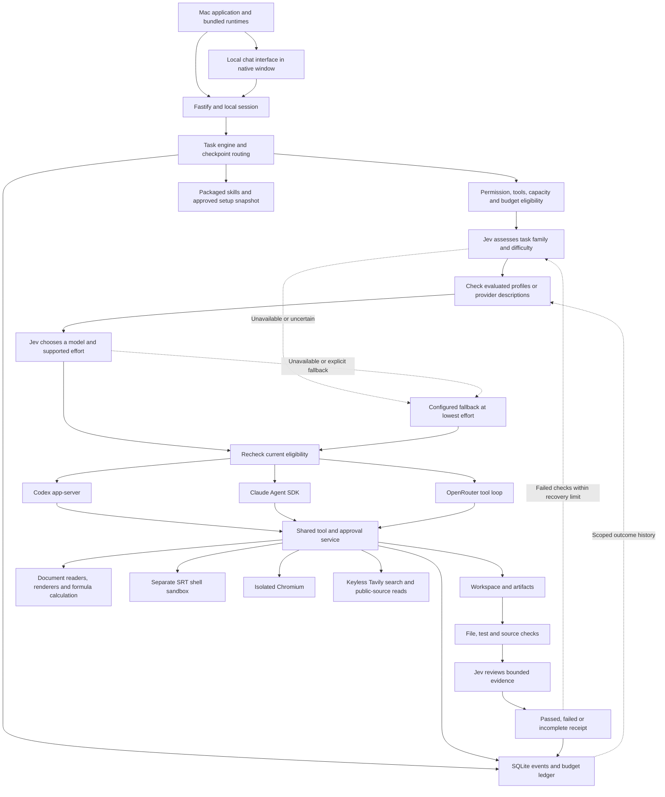
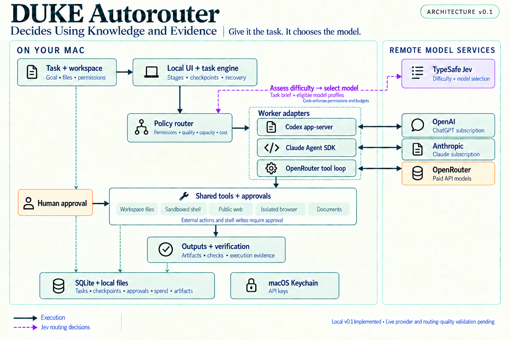

# Architecture

This diagram describes the implemented 0.1 routing and verification flow.
The [routing policy](ROUTING_POLICY.md) covers evidence limits and recovery rules.
The [decision log](DECISIONS.md) explains the product and architecture choices.
The [distribution guide](MAC_DISTRIBUTION.md) covers the downloadable Mac app.

Illustrated overview

[Open the full-resolution map](assets/duke-autorouter-architecture-v3.png).
This September 18 illustration shows the main components. It predates effort
selection, content review, outcome history and live acceptance. Its old status
labels are historical; use the diagram above for the current flow.
The image was created with the built-in image generation tool from the
[saved prompt set](assets/README.md).

## Execution boundaries

`Engine` owns task state, route selection, fallback, verification, and stage
boundaries. `Store` commits events before broadcasting notifications. SQLite WAL
and immediate budget transactions prevent reservations from racing. One running
instance per data directory and a serial task queue prevent concurrent writers.

Codex 0.155.0 is embedded as an app-server subprocess. Its generated experimental
protocol types are checked in. Codex uses client-handled dynamic tools rather
than a separate MCP bridge: this exposes the same broker directly, with fewer
credentials and processes. Native environment access is disabled, the runtime
cwd is isolated, native shell features are disabled, native approval requests
are rejected, and only broker tools have workspace write authority.

Claude uses Agent SDK 0.3.280 and an in-process MCP server. Built-in tools are
disabled, settings sources are empty, and pre-tool hooks enforce the exact
task-scoped tool set. Only first-party subscription authentication is accepted.
Authentication and execution availability are checked separately.

OpenRouter uses its Chat Completions tool protocol in a bounded loop. It pins one
eligible provider endpoint, disables provider fallbacks, requires tool parameter
support, limits output tokens, and sets token-price caps. Events and tool progress
stream to the UI; OpenRouter text currently appears after each model completion.
The adapter does not assume compatibility with Codex's Responses protocol.

## Difficulty assessment and automatic model selection

Jev assesses difficulty and chooses a model and effort. DUKE then runs the task
through the selected worker. Automatic routing is the default. Manual
selection under Task options remains available for evaluation trials or an explicit override.

1. DUKE builds the eligible roster from enabled models, workspace provider
   permissions, required tools, recently known capacity, and API budget. Paid
   candidates need known catalog prices; a tool-capable endpoint is selected within
   those caps before a paid call, unless the user explicitly pins one. The engine uses the same
   first-request byte bound as the paid worker and checks again after Jev.
2. A Jev request asks **Choice** questions for task family and work type, and a **Score** against three
   concrete difficulty levels: routine, standard, and complex. It sees at most
   6,000 prompt characters, 1,000 expected-result characters, requested tools,
   attachment excerpts, project structure counts, checkpoint progress, and whether
   context is incomplete. The private imported setup library is not copied into
   this payload. Truncated context conservatively requires complex-work coverage.
3. Evaluated profiles must meet the task-family quality floor and reviewed difficulty
   coverage. Provider-described profiles are also eligible immediately, with their
   user-declared quality sent as null. Only user-selected roster profiles are eligible. Their descriptions, optional work preferences and user-feedback counts
   inform selection; neither is relabeled as benchmark evidence. Legacy evaluated
   profiles without difficulty coverage qualify for routine work only.
4. A second Jev **Choice** selects a model-effort configuration using the task assessment and model
   profiles: scoped quality/whole-task token observations, work preference, difficulty
   coverage, tools, context limit, billing, prices, and optional routing notes. This is a separate request because questions
   within one request are evaluated independently. The explicit roster is limited
   to 32 models; supported effort levels expand the choices, with a configured-fallback option.
5. DUKE checks the returned candidate against the current roster, permissions,
   availability, and budget, then invokes its worker automatically. The task record
   saves the assessed difficulty, chosen model, decision source, and concise reason.
   Worker failure removes that model before automatic reselection and recovery.

The implementation uses the official `POST /v1/systemone` format and validates
answer types, confidence ranges, distributions, score consistency, and candidate
membership. Assessment confidence must reach 0.8; this is **not a measured
correctness guarantee**. Selection among qualified models has no additional
confidence floor. A valid choice is applied even when several candidates are
similarly suitable. An uncertain difficulty assessment uses the configured economical
fallback; an explicit rules choice or failed selection retains any valid
difficulty assessment and uses the configured fallback. If no model qualifies, execution blocks with the
missing requirement rather than treating an unevaluated worker as proven.

**Automatic selection** applies Jev decisions from first use when connected.
**Shadow test** runs and records the same two decisions without applying them;
it is an optional evaluation setting, not Jev's architectural role. **Off** uses
local rules. The persisted mode names remain `assist`, `observe`, and `off` for
compatibility, under Advanced routing diagnostics. Manual overrides skip Jev and
its API cost. Jev is part of normal routing across projects; no per-project switch
is required, and legacy `jevAllowed` values no longer disable it. Worker provider
permissions and the global operating mode still apply.

The fallback is a selected Luna or Haiku, or another model explicitly chosen in
Usage & routing, at its lowest supported effort. It may make an economical attempt
below declared difficulty coverage. An unavailable fallback blocks without
silently promoting to a premium model. Permission, tool and spending limits still
apply. Normal Jev choices use qualified model-effort profiles, scoped evidence and
starting preferences. Provider defaults receive no preference. See the
[routing policy](ROUTING_POLICY.md) for the full decision flow.
Local automatic outcomes are scoped to family, work type, difficulty and brief size;
they never rewrite benchmark scores. Effort is part of each execution configuration,
so Low and Max do not share quality or token estimates. Failed attempts, routing and review tokens
remain part of cumulative task usage. Unknown usage cannot establish efficiency.
Jev receives early observations and related work at the same difficulty as tentative
guidance, while hard qualification still requires exact evidence. Per-model
execution keys preserve compatible history across roster and preference edits.
The local composer preview uses only these rules, never Jev inference. Actual
execution may choose a different model. Events `jev_assessment`, `jev_selection`,
`jev_unavailable`, and `route` distinguish assessment, proposed dispatch, failure,
and the final validated route. No model-selection accuracy has been established
by the synthetic tests.

Codex capacity checks share one interpreter for the pinned runtime's multi-bucket
usage response, model-specific buckets, and `ordinaryUsageAllowed` account gate.
Missing telemetry remains unknown. The worker refreshes Codex capacity before and
after execution, with bounded metadata requests. Task receipts retain observed
account-window changes separately from tokens and API costs. A reset or missing
snapshot prevents a comparable delta; other apps may contribute to an account's
change. The local preview uses cached telemetry. Claude allowance readings use
an experimental runtime control request and remain separate from Codex windows.
Missing or stale readings stay labeled. Both adapters serve the same resource goal.

## State and recovery

Task states: queued → routing → running → verifying → completed. A tool can move
a task to awaiting_approval. Failures become blocked; explicit cancellation
becomes cancelled. Startup converts active states to interrupted and expires
pending approvals. Queued tasks retain their original authorization.

Stages use fresh native sessions and explicit checkpoints. This avoids restoring
stale tools or permission scopes from provider-native sessions. Session IDs are
kept for traceability. Artifacts have content hashes; previews refuse a changed
file rather than showing a different version under an old record.

Uncertain network responses retain budget reservations. External browser actions
are journaled before execution. An uncertain external action halts automatic
recovery and requires reconciliation. Local file writes are recoverable through
retained backups. Cancellation stops worker process trees and closes browsers.

## Guardrails and practical limits

The server binds to loopback, rejects unexpected Host and Origin headers, and
requires a private HttpOnly SameSite session for API access. Keychain entries are
only used by server-side provider adapters. Shell environments are allowlisted.
Public fetches validate destinations and pin DNS resolution to a public address;
browser requests also reject private destinations and non-HTTPS navigation.

An application on the same Mac with the same user's filesystem authority can
read local state. This is a single-user application, not a hostile-user isolation
boundary. Browser automation is limited to a fresh profile; complex transactional
workflows still require explicit receipt verification by the worker and user.

The shared tool layer includes bounded text/document reads, literal search,
precise text edits, backed-up writes, sandboxed commands, public search and reads,
isolated browsing, document generation and visual previews. Four packaged skills
guide coding, research, writing and documents; imported skills remain distinct
from executable tools.

Word output uses native headings and explicit table grids. PDF output renders an
escaped Markdown tree with bundled Chromium, scripting and subresources disabled.
XLSX supports typed values, named sheets and explicit formulas. A bounded worker
calculates supported formulas with xlsx-calc and Formula.js and rejects errors;
this is not a claim of complete native Excel compatibility.

The Mac helper extracts saved PDF text and renders individual pages. Pages with
no extractable text remain explicitly unverified; OCR is not included. Word
Quick Look previews may cover only a first page. XLSX previews render the saved
cells in a named sheet and range, with cached formula values. They do not reproduce
native Excel layout or charts; separate reads recalculate supported formulas.

Image results use Codex/Claude image messages. Codex's code-mode bridge wraps
dynamic tool output as a string, so its instructions explicitly emit the embedded
image to the model. Live checks confirmed model-visible image input after an
earlier run returned a screenshot without displaying it. OpenRouter image transmission additionally requires
verified input support and rates within the approved price ceiling; otherwise the
worker receives an explicit unavailable-image notice. Image requests reserve a
full input context window to avoid estimating image tokens from compressed bytes.

Search uses Tavily's keyless HTTP endpoint with no API key or paid fallback.
Rate limits and empty results are explicit failures. Results identify sources
to read; snippets alone cannot establish citation support. Direct source reads
support text pages and bounded text-based PDFs. The
[retrieval decision](adr/0012-public-retrieval.md) records this choice and its limits.

Content checks, recalculation and layout coverage remain separate. A content pass
is labeled as such when layout has not been independently checked. See the
[tool audit](TOOL_AUDIT.md) for checks, limits and outstanding evidence.

## Sources checked during implementation

- [Codex app-server](https://learn.chatgpt.com/docs/app-server)
- [Codex configuration](https://learn.chatgpt.com/docs/config-file/config-reference)
- [Claude Agent SDK permissions](https://code.claude.com/docs/en/agent-sdk/permissions)
- [TypeSafe Score](https://docs.typesafe.ai/primitives/score)
- [TypeSafe Choice](https://docs.typesafe.ai/primitives/choice)
- [TypeSafe official SDK wire formats](https://github.com/typesafe-ai/typesafe-sdk-python)
- [OpenRouter provider routing](https://openrouter.ai/docs/guides/routing/provider-selection)
- [OpenRouter endpoint catalog](https://openrouter.ai/docs/api/api-reference/endpoints/list-all-endpoints-for-a-model)
- [Anthropic sandbox runtime](https://github.com/anthropics/sandbox-runtime)
- [Tavily official keyless client implementation](https://github.com/tavily-ai/tavily-python/blob/master/tavily/tavily.py)

## Standalone application

A Swift launcher starts the packaged Node service from an application-owned data
folder and loads its private launch link in a native WebKit window. The app has a
Dock icon, standard editing and window menus, native file selection and save
dialogs. The Dock and menu bar reopen the same window without resetting its draft;
closing the window leaves the service running. Quitting stops the service, which
also stops if its launcher exits unexpectedly. Only the owned loopback origin
loads inside the window. Clicked external web links open in the default browser;
automatic external navigation is blocked. The window uses an ephemeral web data
store; accounts and work remain in the existing application data directory.
The bundle includes production modules, Codex, Claude’s native runtime, and
pinned Playwright browsers. Resource paths are independent of the working folder.
Application state stays outside the bundle so updates do not replace user data.

Account setup invokes provider-owned browser sign-in. Project selection uses a
native folder picker attached to the app window. A WebKit reply handler accepts
folder requests only from the local application's main page; embedded artifacts
and other origins cannot invoke it. Browser sessions retain the authenticated
local helper. Provider model catalogs are discovered automatically after
connection but remain unselected until chosen in My models. Starting work preferences
are optional and do not bypass policy gates. Preview and submission share the complete composer input.
