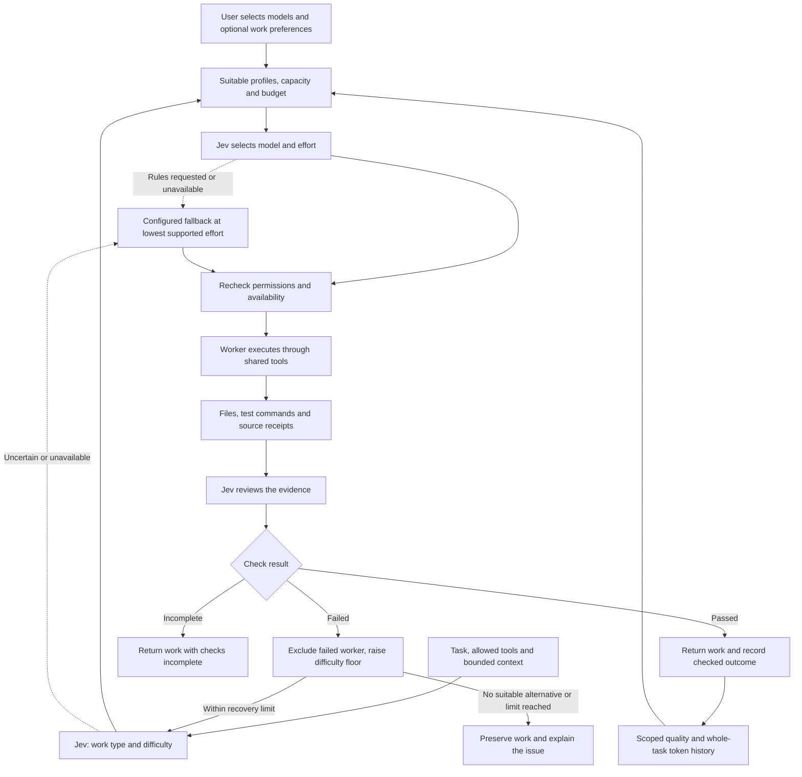

# Selected models, efficiency and automatic checks

Updated September 21, 2026. Policy identifiers: `duke-routing-v10`, `duke-efficiency-v2` and
`duke-review-v4`. This document describes implemented behavior, not measured
live-model accuracy. The [verification record](VERIFICATION.md) covers live
acceptance. Comparative routing and resource claims need separate benchmarks.

## Decision flow

### Task assessment

Jev classifies coding, research, writing or documents, identifies the specific work type (for example UI, debugging or editing), and scores routine,
standard or complex reasoning. The normal path uses two sequential requests:
assessment, then model choice. A third request reviews completed work. Independent
review questions are batched together. Diagnostic Off/Shadow modes do not perform
automatic content review. An explicit worker selection bypasses routing but still
receives content review when Jev is in assist mode.

Routing includes up to 6,000 prompt characters, 1,000 expected-result characters,
selected attachment excerpts (2,000 each / 8,000 total), root-level project
structure counts, and checkpoint progress. An attachment alone no longer forces
complexity. Truncation and unsupported binary input retain a conservative
difficulty estimate. An uncertain or unavailable assessment uses the configured
fallback; an unknown difficulty is recorded without promoting the worker. A quality retry
raises the previous difficulty requirement by one level, capped at complex.

Assessment uses a `0.8` distribution-confidence threshold. Review instead requires
at least `0.8` probability on its selected pass or fail answer. These are different
measures: a live review returned pass probability `0.80` with confidence `0.70`.
The former review policy rejected that answer by testing confidence. The
[scoring investigation](REVIEW_SCORING.md) records the correction and checks.
Neither measure establishes an 80% real-world success rate for DUKE. Model choice has no separate
confidence floor: a close choice among already-qualified models does not justify
a more powerful fallback. DUKE records the confidence and follows a valid choice.
An explicit `use_rules` choice, unavailable service or malformed answer uses the
configured fallback. Permission, capability, availability and budget checks still apply.
This distinction follows [TypeSafe's description of confidence](https://docs.typesafe.ai/confidence):
selection confidence reflects the separation among options, not task success.
Calibration still requires held-out comparisons.

### Candidate policy

- Workspace permissions, tool capabilities, model enablement and available
  budget remain hard gates. Known disconnected/exhausted states persist until
  a reset or refreshed status. Stale health is refreshed before execution where
  the adapter supports it; a failed refresh cannot clear a known block.
- Explicit difficulty coverage is enforced even for provider-described profiles.
  Legacy evaluated profiles without coverage retain routine-only eligibility.
  A writing evaluation does not establish document capability.
- User-declared scores must meet the family quality floor. Provider descriptions let
  new accounts start without manual qualification. Unknown quality stays unknown.
- A user-selected roster of at most 32 models bounds the decision. Connecting an
  account discovers available choices without activating them. OpenRouter is an
  optional connector; its catalog is searchable only when choosing models.
- Optional work preferences are starting points, never measured capability or
  hard assignments. A preference cannot activate an unselected model or bypass
  quality, difficulty, tool, workspace, capacity or affordability requirements.
- Jev chooses the least necessary resources to finish useful work at the required
  quality. This objective applies equally to subscription allowance and API use.
  Whole-task reported tokens are one practical proxy, including retries and tool
  loops. A stronger model can be efficient when a weaker model would need recovery.
  Jev assessment, selection and review remain normal product functions. Reducing
  Jev calls or bypassing it to save small API amounts is not this build's objective.
- Within the qualified candidates, DUKE ranks demonstrated adequate quality ahead of unmeasured
  profiles. Within that tier, the explicit work preference comes first. Then
  complete scoped efficiency evidence precedes missing evidence; lower observed
  tokens per successful task wins. Missing consumption is unknown, never free.
  Adequate difficulty coverage, optional feedback and stable ID
  break remaining ties. Jev can choose any qualified model, including a model
  without sufficient efficiency history. Quality above the required floor is not maximized.
  Subscription billing and the provider's default-model flag do not give a candidate preference.
- No generic model-name ranking or invented token-efficiency scores are used.
  With sparse evidence, routing relies on descriptions and preferences. This is a
  cold-start policy, not proof that DUKE has found the best model.
- Catalog refresh updates ordinary prices/context limits. Explicit edits and
  pinned endpoint caps remain pinned. A changed/unavailable API endpoint can
  fall back to another worker without exceeding those caps.

TypeSafe reports probabilities and scores rounded to two decimal places. DUKE
accepts sums consistent with that precision, including 0.99 and 1.01. It keeps the
reported values for thresholds and receipts; normalization cannot promote a
verdict below 0.8 into a pass. Missing keys, impossible totals and all-zero
answers still use the unavailable-result path. See the
[TypeSafe provider reference](https://ai-sdk.dev/providers/ai-sdk-providers/typesafe-ai).

### Configured fallback

`Jev fallback model` in **Usage & routing** defaults to a selected, available Luna
or Haiku. A user may explicitly choose another selected model. The fallback uses
its lowest advertised effort; a model with no effort control uses its provider
default. A missing, exhausted, disabled, unaffordable or out-of-scope fallback
blocks the task with an explanation. It never silently substitutes Astra, Opus,
Fable or another unconfigured model.

Fallback is an economical attempt, not a claim that a small model is qualified for
an unknown task difficulty. It may run below declared difficulty coverage, while
permissions, required tools, user-declared quality limits and spending limits
still apply. Automatic failure history can exclude a model from Jev's shortlist,
but does not disable the configured outage fallback. This permits a cheap attempt
when previous automated checks were sparse or unreliable. Uncertain assessments do not produce positive learning evidence.
Checks still run afterward. A failed worker is excluded from recovery, which asks
Jev again; if Jev is still unavailable, only an available permitted fallback can run.

### Reasoning effort

Jev chooses a model and effort together. Candidate configurations use levels
advertised by the Codex app server, Claude SDK or OpenRouter model catalog. No
unsupported setting is invented. If no control is advertised, the route says
**Provider default**. Codex receives `turn/start.effort`, Claude receives the SDK
`effort` option, and OpenRouter receives `reasoning.effort`.

The selected effort is saved with the route and execution receipts. Quality and
whole-task token history are scoped to that model-effort configuration; unknown
legacy effort is not reused for an explicit effort setting. A model at Low and
the same model at Max therefore have separate evidence. The UI shows the chosen
level beside the model. Effort names are provider settings, not equal token budgets
or guarantees of quality. The objective remains the least resources likely to
finish useful work, including retries.

The 32-model roster expands into supported effort choices. If it would exceed
254 configurations plus the fallback choice, intermediate Minimal variants are
omitted where None is also available; the lowest and highest settings remain.

The engine rechecks permission, availability and budget after Jev responds.
Feedback and automatic evidence are selected using Jev's assessed family rather
than the earlier keyword guess.

Each routing request has a five-second deadline. Content review has thirty
seconds because it examines a larger evidence payload. Cancellation still stops
both. A timeout leaves its API reservation uncertain and review incomplete.

## What verification establishes

Every completed attempt receives a receipt with passed, failed or unverified
checks. A claimed success or a nonempty file alone cannot produce a checked
success. Deterministic failures are handled before asking Jev to judge content.

| Work | Checks |
| --- | --- |
| Coding | Required outputs and the explicit verification command, or a recognized read-only test command rerun after the worker finishes. No observed test means checks incomplete. |
| Research | Source URLs must have retrieved-body receipts from `web_read` or `browser` when web/browser research is requested; Jev assesses whether the excerpts support material claims. Search snippets alone do not qualify. URLs in code examples or source-code artifacts are not treated as citations. |
| Writing | Jev checks the requested brief, factual support and completeness against bounded task inputs and outputs. |
| Documents | Required files, core Office XML/text or PDF page structure; Jev checks readable content against the brief. Generated PDF text is used only while its bytes match the generation receipt. |

Word text preserves table, row and cell boundaries. Public web text preserves
semantic deletion and insertion markers; visual styling supplied only through CSS
is not recovered. These cues are source evidence, not trusted instructions.

Office ZIP inspection bounds compressed/expanded sizes, validates inspected XML
checksums, and never extracts files or executes macros. Binary formats, oversized
inputs and insufficient excerpts remain unverified. File hashes are rechecked
after the remote review so outside edits cannot create stale positive evidence.

These checks do **not** establish rendered document layout, recalculated spreadsheet
formula correctness, adherence to private operating instructions withheld from
Jev, or the independence of tests authored by the worker. Those limitations appear
in the receipt. A Jev content judgment can also be wrong; it is not the release
benchmark's final judge.

Failed checks use the existing recovery limit (two retries by default) and preserve
files, checkpoint and external-action ledger. Permission failures and uncertain
external actions remain blocked; they cannot trigger an authority-bypassing retry.
An unavailable, cancelled, malformed, uncertain or unaffordable review does
not count as a quality failure. Incomplete checks never count as positive evidence.
Timeouts, output limits, missing runners and sandbox startup failures also leave
checks incomplete. Only a command that actually started and returned a nonzero
exit is a failed test. Cancelled work does not create a learned outcome.
Review records retain the selected answer, full probability distribution,
distribution confidence, model version and threshold. The versioned quality and
efficiency histories keep earlier acceptance rules separate; saved task reviews
are not rewritten.

## Local outcome history

Automatic receipts do not rewrite manual benchmark scores or mark a model as
evaluated. Routing uses at most the last 50 distinct tasks per model, family, work type, brief-size band and
difficulty from the last 90 days, under the current review policy. Retries/resumes
of the same task do not multiply its evidence. Routine successes cannot establish
complex-work coverage, and results do not transfer between model identifiers.
New receipts also record the model's execution configuration. Changing that model's
version, endpoint, output/context limits or tools separates its evidence. Changing
a description, work preference or unrelated roster entry does not.

Jev receives the first checked outcome immediately as tentative guidance. Alongside
exact evidence, it receives up to four relevant neighboring groups from the same
family and difficulty. Matching work/size has weight 1; another work category or
an adjacent size band each halves that guidance weight. Short-to-long transfer,
cross-family transfer and routine-to-complex transfer are excluded. These weights
are explicit policy heuristics, not calibrated probabilities. Groups may contain
overlapping tasks and are never summed into independent sample counts. Related
evidence cannot establish exact-task qualification or override a hard gate.

A Wilson interval prevents a few successes from becoming a perfect success-rate
claim. A positive capability estimate requires at least five checked outcomes
and a conservative bound that meets the quality floor. At the default 0.8 floor,
five successes are insufficient; twenty successes with no failures clear it.
Legacy observations without the new work/size scope do not establish quality for a new scoped task. Three or more observations whose upper bound is below the quality floor exclude
that profile from Jev's shortlist for that family/difficulty. The configured outage
fallback is exempt from this automatic exclusion. These are provisional heuristics over
automated judgments, not calibrated population-accuracy guarantees.

Benchmark tasks are explicitly marked `evaluation: true`; their receipts and
optional feedback are excluded from normal routing history. The benchmark records
its starting profile hash to reject comparisons made under different profiles.

## Whole-task resource accounting

The usage ledger separates routing, worker and review calls. Codex cumulative
snapshots replace previous snapshots within the fresh worker session. Claude uses
its per-model totals, including auxiliary calls; cached reads/writes join its
input count. OpenRouter adds each request once, keyed by reservation. Jev reports
input tokens. Cached input and reasoning subsets are not counted twice.

A task's total includes every attempt, stage and same-brief continuation. Its
latest efficiency record contains the cumulative total and retains the original
model's attribution, even when another model finishes recovery. Changed briefs,
manual/benchmark runs, incompatible execution settings and cancelled runs do not
provide comparison evidence. Incomplete usage or unverified results remain
visible and cannot make a route look inexpensive. Interrupted provider calls
without final totals remain incomplete even if some counts were received. A pending
run is persisted before worker execution. Active work is excluded from learning;
after a crash its unknown result remains visible and blocks false savings claims.

For the same model execution configuration, Jev mode/version, tool/recovery limits,
work family, work type, difficulty and brief-size band, DUKE uses the last 50
distinct tasks within 90 days. Roster and preference changes retain compatible
history, including same-brief continuations. Changed roster context is counted
explicitly: costs include the recovery paths actually taken, and removing a fallback
can make that history less predictive. Raw history is retained, not erased.
Legacy v1 cost receipts lack per-model configuration, so they can be reused only
while their original full configuration still matches.

An estimate becomes available after the first fully reported accepted task:

`tokens per accepted task = tokens from complete, reviewed tasks, including failures / accepted tasks in that subset`

The summary also reports total tasks, successful tasks, sampled tasks/successes,
incomplete tasks, every known token and tokens from incomplete tasks. One unknown
report no longer suppresses all the complete observations. It does prevent a hard
efficiency ranking or savings claim. Jev sees the coverage and uses early/partial
evidence as tentative guidance. Evidence-based ordering still requires five fully
reported accepted tasks and no incomplete results before ranking by exact-scope
tokens. Related evidence is guidance for Jev, never a hard efficiency ranking.

Brief size is a rough byte band for briefs and attachments, not a claim that all
workloads within a band are equivalent.

This observational estimate is provisional and subject to selection bias. It is
not a randomized comparison or a guaranteed success probability. Tokenizers and
subscription charging differ, so reported tokens are a practical resource proxy,
not interchangeable quota units or actual dollars saved. Quality gates remain
separate. No training updates are made to Jev itself.

### Subscription allowance

Codex's adapter reads account limits immediately before execution and again when
the worker finishes. The metadata read has a three-second timeout and makes no
inference request. A failed final read does not fail completed work. Each worker
attempt records its own snapshots; task receipts and restart recovery preserve them.
Provider token totals are also separated by provider and by routing/worker/review.

The UI and benchmark show the observed change in each account limit/window. They
never add percentages from different providers, limits, durations or reset periods.
Missing endpoints, reset boundaries, decreased percentages and changed windows
make the change unknown. An unchanged percentage may reflect rounding or delayed
updates. Other applications on the account may contribute, so this is not an exact
quota debit attributable to DUKE. Claude allowance remains unknown when its runtime
does not expose it; its reported tokens still contribute to resource accounting.

## Upgrade behavior

The first run of this version moves legacy automatically enabled catalog models
back into available choices. It retains their prior IDs in the local roster
record and asks the user to choose once. Accounts, setup imports and model
settings are retained. Manually created profiles retain their selection. Later
refreshes preserve selected IDs and leave new discoveries unselected. The
selection and preference endpoints require the authenticated local session.

## Data sent to Jev

Routing and review send bounded task briefs, selected attachment excerpts,
checkpoint progress, project structure counts, model profiles, task-file excerpts
read by the worker, deliverable excerpts, retrieved source excerpts and check results.
The private imported setup library and account credentials are not copied into
those requests. Material quoted into a task deliverable can be included in its
review. All Jev requests pass through the existing API reservation/budget ledger.

## Evidence needed for routing and savings claims

The expanded corpus contains 80 fixtures: 20 for each work type, split equally
between development and held-out cases. Default small runs rotate across all
four types. Comparison requires matching profiles/cases, independent acceptance
review and at least five held-out cases per type. It reports per-type acceptance,
critical failures, total latency, retries/stages, settled API cost, unresolved
reservations, whole-task tokens by provider/role, and subscription-window changes
with telemetry coverage. Token reduction is reported only for complete usage and
no observed per-family acceptance regression or critical failure. API cost per
accepted task is withheld while any request remains unsettled. Overlapping account
intervals cannot be added into a quota total. There is no combined token/dollar/quota
score and no fabricated subscription-dollar conversion.
Confidence bands are compared with outcomes without treating confidence as a
success probability. Subscription fees are not counted as per-task API spend.

The corpus starts with small coding utilities and document fixtures. It needs
broader project changes and adversarial cases before supporting general claims. No quality, cost-saving
or general superiority claim is established until approved live runs and independent
review produce evidence. The normal user never has to score models to start DUKE.
See [benchmark protocol](BENCHMARK_PROTOCOL.md) for the next development pass.

## Uncertain API charges

A timeout or ambiguous provider failure retains its reservation in the original
calendar window. It does not permanently consume every future month's budget.
After a task stops, an authenticated user can record a provider-verified amount
and billing reference in the request ledger. This creates an immutable correction
receipt with the original reserve, verified amount, note and timestamp. A repeated
or stale correction is rejected; delayed settlement cannot erase it. Zero is an
explicit billing finding, never the automatic default for an uncertain request.
Costs include settled and manually reconciled entries. Saved evaluation reports
are snapshots; later ledger corrections do not silently rewrite prior reports.

## Reading recovery evidence

Efficiency measures the whole task starting with the initial model choice,
including every recovery worker, stage, routing call and review. An accepted task
that recovered does not mean the first model succeeded alone. New records flag
recovery; legacy records without that flag are labeled unknown. This annotation
does not change the token denominator or retroactively discard failed attempts.
The usage page separates eligible history, complete token coverage and recovered
successes. These counts describe retained compatible evidence, not all historical
tasks and not measured routing superiority.
