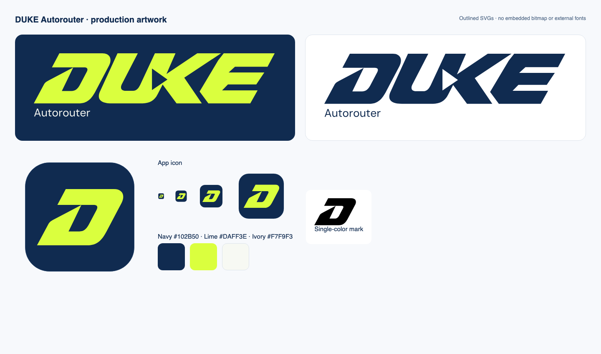

# Brand and architecture assets

## Wordmark and icons

The selected Impulse identity uses forward-leaning lime lettering on navy, an
ivory Autorouter subtitle and a standalone D mark. The original
[generated artwork](duke-autorouter-wordmark.png) is retained as the design
reference. The production SVGs redraw that geometry with flat fills and outlined
lettering; they contain no embedded bitmap or external font dependency.

| Use | Asset |
| --- | --- |
| README and presentation banner | [Navy banner](duke-autorouter-banner.svg) |
| Wordmark on dark surfaces | [Lime and ivory](../../src/brand/wordmark.svg) |
| Wordmark on light surfaces | [Navy](../../src/brand/wordmark-ink.svg) |
| Single-color wordmark | [Black](../../src/brand/wordmark-mono.svg) |
| Standalone D | [Lime](../../src/brand/mark.svg), [navy](../../src/brand/mark-ink.svg), [black](../../src/brand/mark-mono.svg) |
| App icon and favicon | [SVG](../../src/brand/app-icon.svg), [1024px PNG](duke-autorouter-app-icon.png), [Mac ICNS](../../desktop/Assets/AppIcon.icns) |
| Native menu bar | [Template SVG](../../src/brand/menu-bar.svg), [1x PNG](../../desktop/Assets/MenuBarTemplate.png), [2x PNG](../../desktop/Assets/MenuBarTemplate@2x.png) |

Brand colors are navy `#102B50`, lime `#DAFF3E`, and ivory `#F7F9F3`.
Use the navy or monochrome artwork on light backgrounds; lime belongs on dark
surfaces. Preserve the aspect ratio and leave clear space around the mark.
Use the standalone D when the full wordmark would be too small to read.

The subtitle uses outlined DM Sans; its [SIL Open Font License](../../src/brand/DM-Sans-OFL.txt)
is included with the vectors. The application imports SVGs directly, so Vite
includes them in both source builds and the standalone Mac package.

To regenerate the committed Mac icon and menu bar PNGs on macOS after editing
the SVGs, run `npm run brand:icons`. It uses the installed Playwright browser and
macOS `iconutil`, with no model calls or new dependencies. The packager includes
these assets before signing the bundle.

## Historical architecture image

- September 18 illustration: [duke-autorouter-architecture-v3.png](duke-autorouter-architecture-v3.png)
- Method: the existing map corrected with the built-in image editing tool.
- Current diagrams: [implemented architecture](../ARCHITECTURE.md). The earlier
  illustration predates effort selection, content review, outcome history and
  completed live checks. Its footer describes the state when it was made.

The September 18 updates adopt the selected complete name, remove the API-limits
panel, and show Jev's contribution as **Assess difficulty → select model**.
Shadow test is an evaluation setting; automatic model choice is its intended role.

Historical edits from v1 through v2:

1. [Name, acronym expansion, and tagline](duke-autorouter-branding.prompt.txt)
2. [Remove the API-limits panel](duke-autorouter-footer.prompt.txt)
3. [Describe Jev's architectural role](duke-autorouter-role.prompt.txt)

The [difficulty and selection correction](duke-autorouter-difficulty.prompt.txt)
was applied to [v2](duke-autorouter-architecture-v2.png). Its
[previous manifest](image-manifest-v2.json) is retained.

The original [v1 map](duke-router-architecture-v1.png), its
[manifest](image-manifest-v1.json), and exact prompts are retained as history:

1. [Initial architecture and visual brief](duke-router-architecture.prompt.txt)
2. [Contrast and connector refinement](duke-router-architecture-refinement.prompt.txt)
3. [Final observation-label correction](duke-router-architecture-label.prompt.txt)

The September 18 map separates local execution from remote inference,
subscription quotas from API spending, and Jev selection from worker execution.
The original images, prompts and manifests remain unchanged as design history;
their old status labels do not describe the current release.
