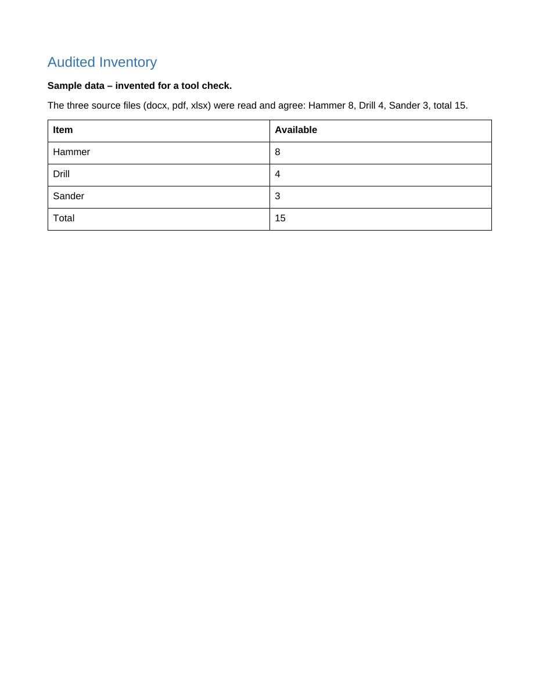
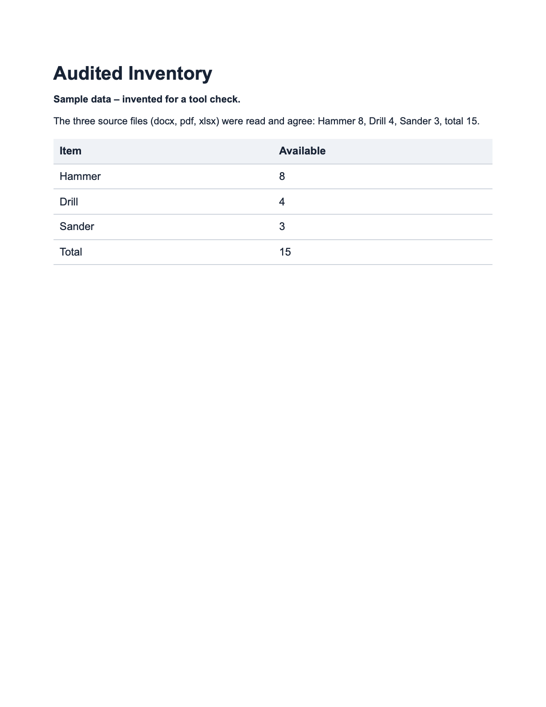
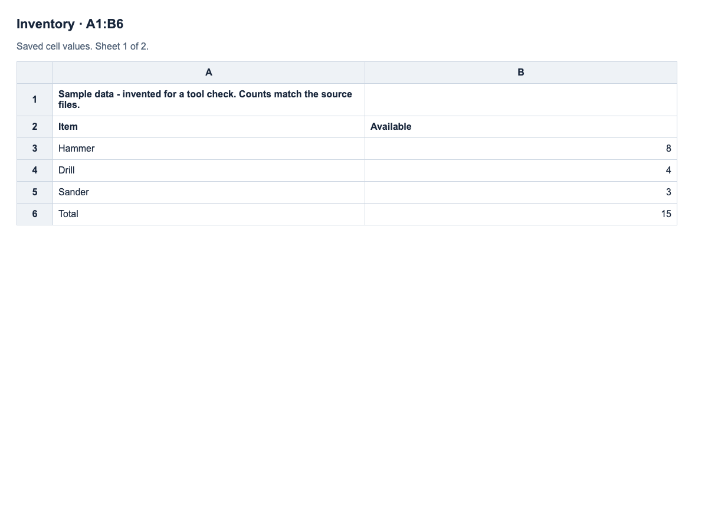
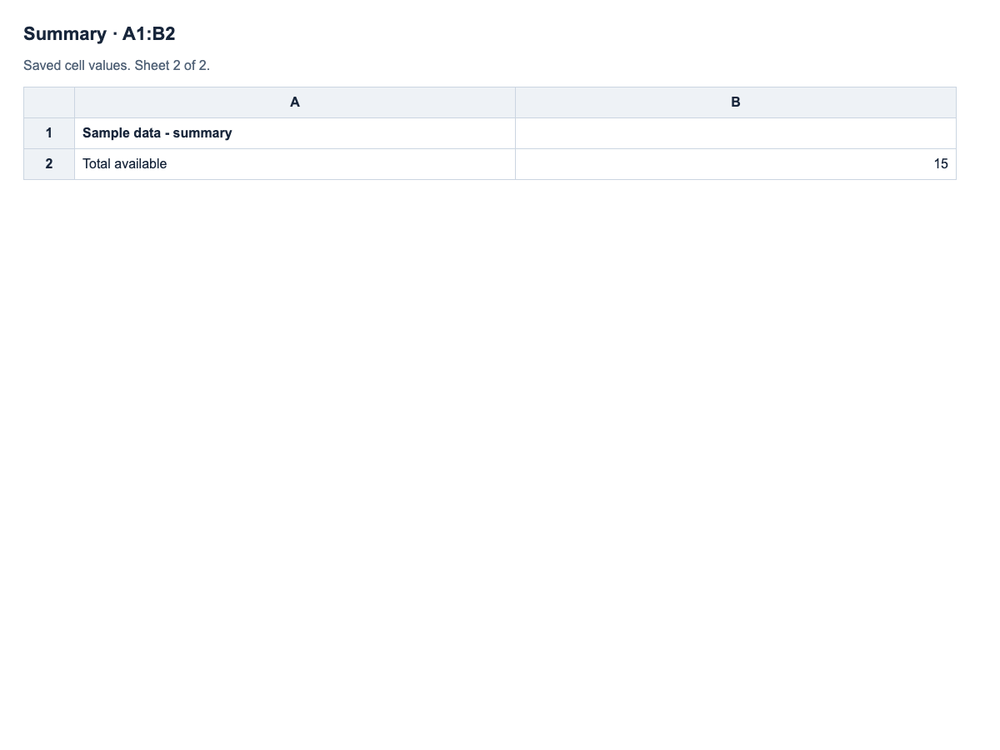

# Tool acceptance samples

These files came from public or invented acceptance tasks. Worker outputs are
copied unchanged. Images below were rendered from the saved files during
independent inspection. [Hashes](manifest.json) identify the exact bytes.
The [verification receipt](../tool-audit-verification.json) records scope and limits.

| Work | Output | Check |
| --- | --- | --- |
| Coding, Luna Low | [Utility](coding/sum.cjs), [tests](coding/sum.test.cjs) | Five Node tests independently rerun. |
| Writing, Luna Low | [Fictional tool-library note](writing.md) | Compared against the supplied hours, fee, borrowing and return rules. |
| Research, Luna Low | [MDN research note](research.md) | Original source retrieved; public PDF read; actual browser screenshot delivered to the model. |
| Documents, Sonnet Low | [Word](inventory.docx), [PDF](inventory.pdf), [Excel](inventory.xlsx) | Saved files reopened, counts checked, supported formulas recalculated and layouts inspected. |
| Workbook inspection, Sonnet Low | [Review note](spreadsheet-review.md) | Both requested ranges viewed; cached previews distinguished from recalculation and native layout. |

Run the coding sample with `node --test coding/sum.test.cjs` from this folder.
These small tasks check tool operation, not general coding or model capability.

## Rendered output

[Inventory](inventory-native-render.png) and [Summary](summary-native-render.png)
were also rendered independently with LibreOffice during development QA.
LibreOffice is not a DUKE dependency. Native Microsoft Excel was not used.

The [shape input](shape-input.png) was used to check actual image delivery to
Codex and Claude. Both workers described the blue circle and red square.
Stored public evidence excludes native session logs and base64 tool transcripts.

The Word and PDF samples contain one page; the workbook contains two sheets.
These results do not establish arbitrary Office layout preservation or native
Excel formula compatibility. Earlier failures and remaining release checks are
recorded in the [tool audit](../../TOOL_AUDIT.md).
